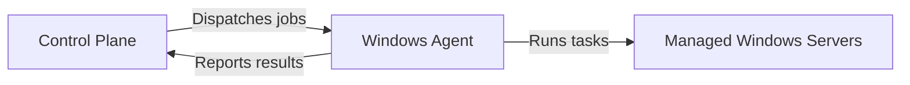

# How I Built a Distributed .NET Agent Platform for 2,000+ Windows Servers

## Background

I worked for a web hosting company from 2010 through 2021. I spent my first 3 and a half years there as a support tech
learning the ins and outs of web hosting, DNS, networking, IIS, cPanel, etc. I learned so much in that role and I was and
still am grateful to have that experience.

In 2014 I was about to take on a junior development role at a vocational school in Tulsa. I had been taking
programming classes in community college and had decided that what I really wanted to do was write software for my career.
I ended up staying at the web hosting company and starting my software development career there instead.

_"This is where the fun begins" - Anakin Skywalker_

## The System

  We had ~2000 customer and internal servers when I took on this project.
  .NET Core 2.0 had released and I had just under 4 years of experience with our
  Web Hosting Control Panel. It was a centralized hub that both the support and
  development team used to make changes to customers accounts and hosting
  experience. Customers also had their own view inside of the application that
  allowed them to make basic changes to their servers and account.

## The Problem
- Our update system at the time relied on WCF time validation for authentication
- Updates took ages to propagate throughout the entire system

## Example architecture

This diagram shows the basic relationship between the control plane, agents, and the servers they manage:

[---]
